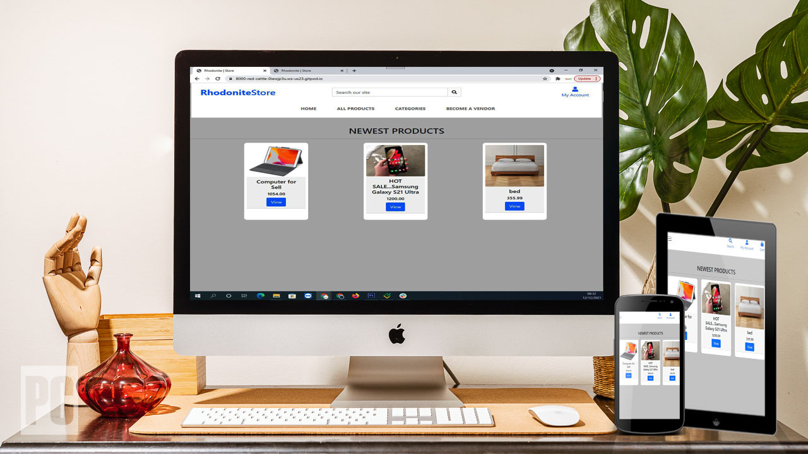
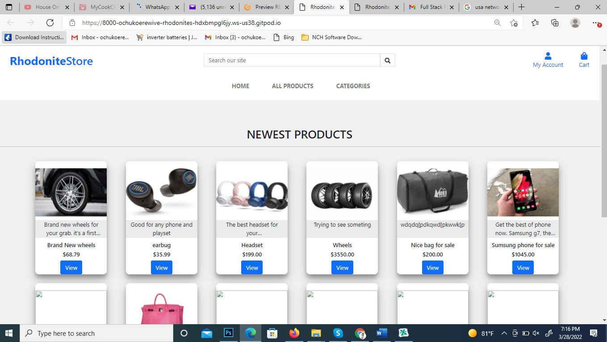
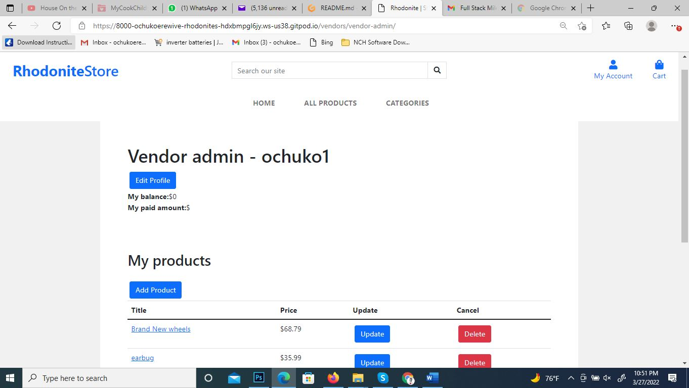
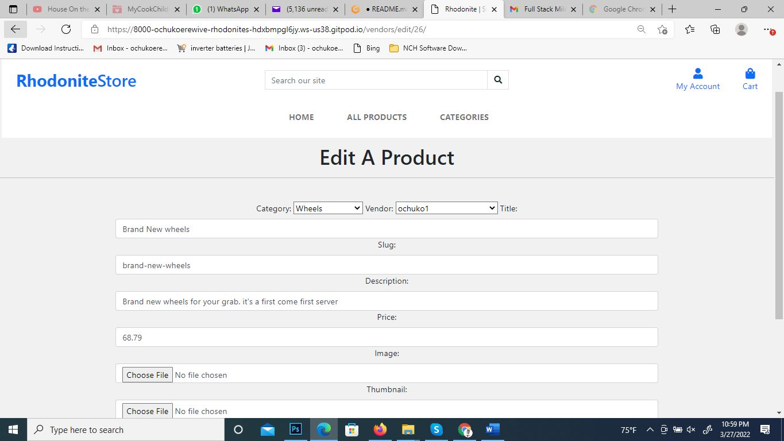
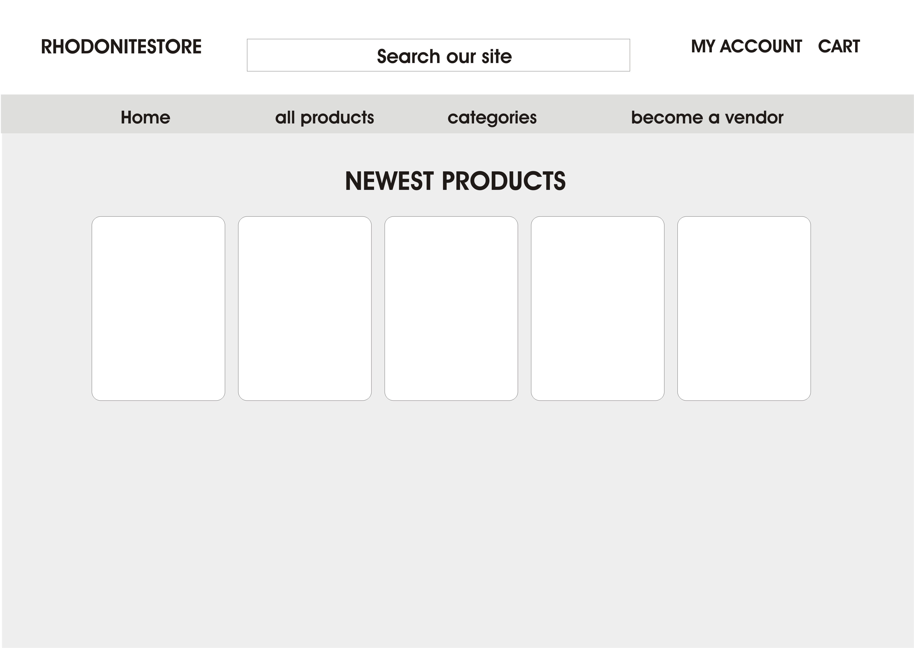
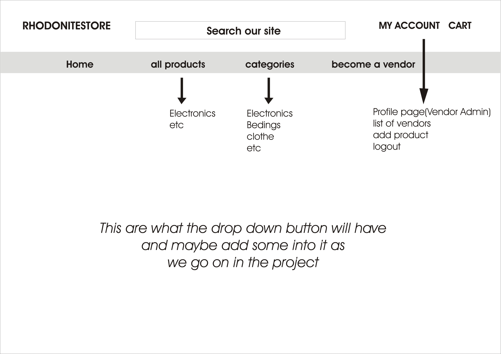
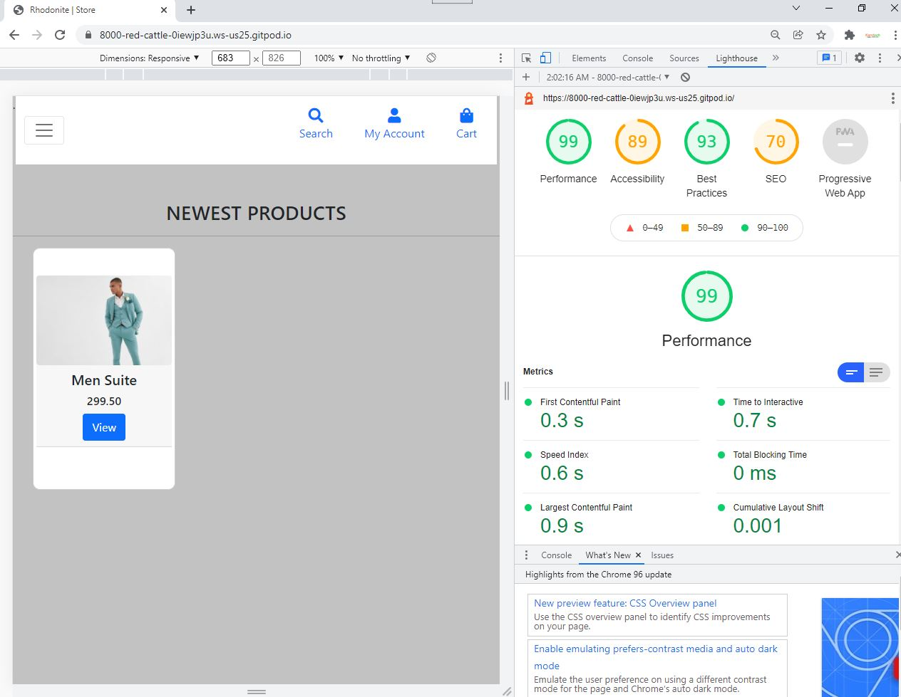
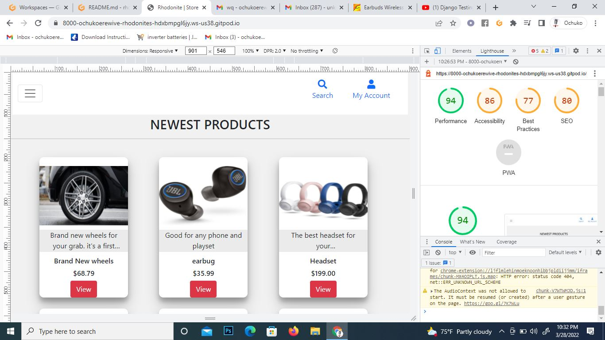
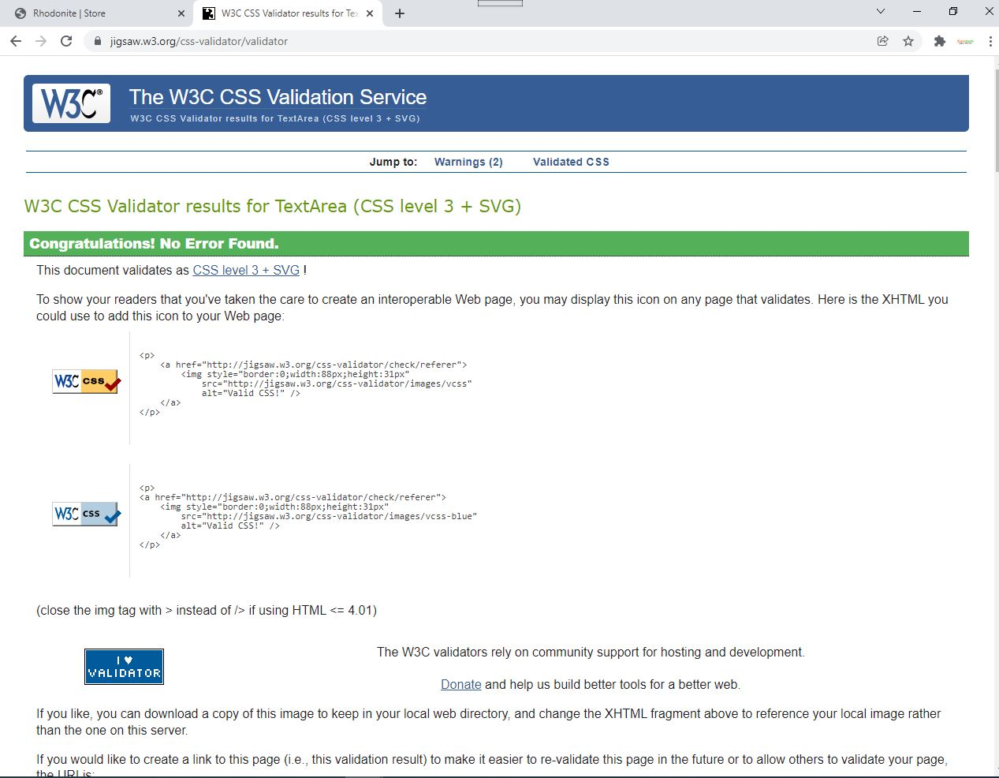

# MS4 PROJECT
## (RHODONITESTORE APP)

## Full Stack Frameworks with Django Milestone Project.

The RHODONITESTORE website is designed and programmed to multi-task. It gives opportunities for store owners to own an online store to which all their products can be displayed. It helps in providing a wide flow of customers. 
In the site, sellers are buyers can navigate easily around the store with the infomation right infront of you. Easy clicks that takes you directly to the needed action or required page.

Rhodonite-store is a multi-tasking app that when inproved upon, can match toe to toe with one of the leading e-commerce site we have presently alround the world. It involves sellers which is also known as vendor, to register and also upload their products to the market store whereby buyers can see and make their choices of what to buy. The app is interative, friendly and easy to navigate through in and out of it.

Both buyers and sellers, upon registration, have equal access to buy or to sell from their online store.

This website/app is presented by Ochuko Erewive. A "Full stack frameworks with Django Milestone Project course in Code Institude". It a site strickly for educational purposes. It is built to have the basic and needed requirement for the purpose of the course.

The project is also deployed in Heroku on;

https://rhodonitestore.herokuapp.com/
------------
#
## SuperUser Account Details
Information given through via submission
#

## USER EXPERIENCE (UX)
The goal of the website is to get all information, and also see to it that all aspect is tourched as regards to the course outline. Its eductive and the site makes it easy for buyers to visit to purchase items, it's also built majorly for an ope market, Helping to create an online store. 
#
A quick run through on how the app functions and runs.
When registered or signed in, It takes you straight to your admin page(Profile page), there you could see all your purchases and products. In your admin page, you can edit your name, also edit your products by updating and in addition, delete any product you no longer need in your store.

In your admin page, the CRUD functionality is shown and functioning.
#
From the home page,
* the newest product lined out first before the other product.
* To click a product of choice, you will have to click the view button which add straight to the add to cart page.
* You will be asked how many you will want to purchase.
* From the Cart page, personnel form for shipping and also payment details is required.
* Then a successful page

## USER STORIES
### The Acceptance Criteria: 
This is to ensure the major focus is carried out which are the following;
+ Search for a product by name or category.
+ View products by category.
+ View images and details for each product.
+ Add to cart from the detail or search pages.

Other User Stories are;
+ Make it possible to log out and log in
+ Show newest products on the frontpage
+ Show detail view of a product
+ Make it possible to add products to cart
+ Make it possible to remove product from cart
+ Make it possible to update quantity
+ Make is possible to checkout
+ Make it possible to edit vendor
+ Make it possible to update product in the Admin Page
+ Make it possible to delete a product right from the Vendor Admin page
+ Notify the vendor after a sale

#
## UX FRAMEWORK
1. STRATEGY
To create a virtual market place whereby vendors are registered and given a store which is opened and easy to view. The website has the ability to edit, update and delete any product by choice.
It's designed to show a structural functionality from the registration to ordering of product also adding of product.
It's designed using the following programming code: HTML, CSS, JAVASCRIP, PYTHON-3 using DJANGO framework. The main goal is to see how well to apply te knowledge learnt and that all function are functioning  accordingly.

2. SCOPE
To ensure CRUD availability/functionality to show site is interactive and allows users to input information, edit and also delete information at their discresion.

The functionality requirements includes the following:
+ My Account
+ Cart
+ Search bar
+ Home
+ All Products
+ Categories
+ Become a vendor(Registeration)
+ List of vendors(This page is ristricted for only admin)
Add product
+ Profile page(Vendor Admin)
#
3. STRACTURE
When the website is lunched, it takes you to the home page whereby you can view but by clicking on any item, it takes you to the registration page to get your details.
upon getting details, that means you have been registered. then you are redirected to the home page where the view button is now blue.
this indicates that you are registered and you have full access to the web page; whereby you can upload product and delete product you uplaoded.
The main navbar contains the
+ Home page: By clicking on the home page, it takes your back to the home page where you may start all over in your search.
+ product: Containing products inputed/created by the admin
+ category: Containes the list of categorized items in the web page. By clicking from the drop down, you can click on any of the list which brings to you a filtered search requested by you.
#
* VIEW BUTTON: To click the view button, it takes you to the "Add to Cart" page where you can either add the number of the item you wish to purchase.
#

* DELETING ITEMS OR REMOVING AN ITEM FROM CART
    An item can be removed directly from CART or deleted from it. 

4. SKELETON: 

* SURFACE:
    + Use of font awesome
    + Navigation and base color: Grey
    + Font color: Black
    + Footer color: Blue

## WIREFRAME
The wireframes was designed using corel-draw platforms. It can be located in a folder called "ReadmeFiles" and also it is uploaded to github for assessment.
#

#
## FEATURES
### Existing Features
1.  Structure and Navigation functionality
2.  User Authentication functionality
3.  User Interaction functionality
4.  Profile page(Vendor Admin)
5.  Uploading product and category
6.  Working Navbar
7.  CRUD functionality for user
8.  Add to cart functionality
9.  Stripe payments system(the card number to use is:

+ 4242 4242 4242 4242 4242
+ Then the date should be future for the stripe system to work)

10. Multiple Apps
11. Data Modeling
#
## TECHNOLOGY USED
1.  HTML5
2.  CSS
3.  JavaScript
4.  Python 3
5.  BootStrap
6.  Stripe payments
7.  Amazon

#
## SECRET KEYS
All secret keys are collected from gitpod variable. The idea is to ensure its save.

#
## TESTING
It is tested on phone devices, computer laptop and computer desktop. On browser, we tested it on google Chrome, windows browser, firefox browser and mozilla.

Tested on hardware devices, using Dell and Hp pcs.

# Performace testing
Tested some function in the Vendor(view and models) to reduce bugs and error flags.

#

## Code Validation

+ W3C CSS Validator to validate CSS.

+ Nu Html Checker to test HTML.
+ Python code was validated using the ExtendsClass Python Syntax Checker with no syntax errors found.
#

# THINGS TO PERFECT LATER
+   The User Pforfile page specifically for all information related to his uploaded orders and also order purchased from his store.
* Populating the menu bar and adding  some functions in the site as regars to each store owner.
#
# DEOLOYMENT

## Heroku Deployment (https://rhodonitestore.herokuapp.com/)

### Content
The content was created by following the Code Institute tutorial for the Full Stack Django-Phyton project as a base, and heavily modified by myself to suit my use case

## Acknowledgements
* Code Institute group on slack
+ Tutor support team
